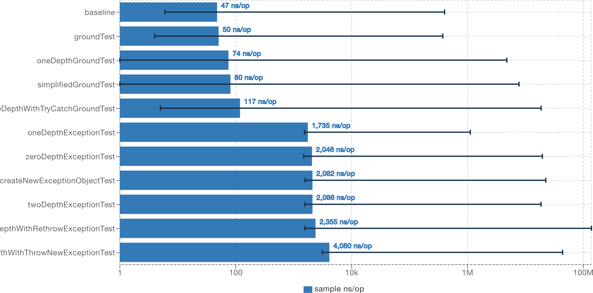
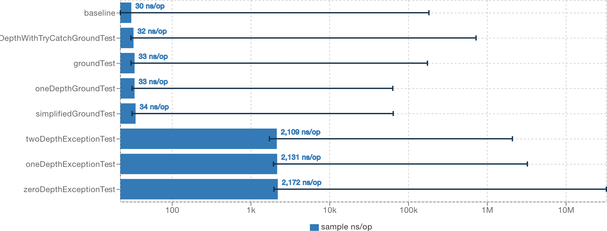

# Java Exception Benchmark

a set of jmh benchmarks
to investigate performance impact of
`Exception`s in Java 

## Results

### Local

| Benchmark                        | Mode   | Cnt     | Score    | Error    | Units |
| -------------------------------- | ------ | ------- | -------- | -------- | ----- |
| baseline                         | sample | 1134053 | 46.76    | ±   2.20 | ns/op |
| createNewExceptionObjectTest     | sample | 1666546 | 2081.74  | ±  67.57 | ns/op |
| groundTest                       | sample | 1901950 | 49.54    | ±   0.86 | ns/op |
| oneDepthExceptionTest            | sample | 1865784 | 1735.26  | ±   7.20 | ns/op |
| oneDepthGroundTest               | sample | 1770152 | 74.46    | ±  11.70 | ns/op |
| oneDepthWithTryCatchGroundTest   | sample | 1632066 | 116.62   | ±  48.16 | ns/op |
| simplifiedGroundTest             | sample | 1752139 | 79.57    | ±  17.45 | ns/op |
| twoDepthExceptionTest            | sample | 1675913 | 2086.26  | ±  69.70 | ns/op |
| twoDepthWithRethrowExceptionTest | sample | 1666845 | 2355.16  | ± 290.36 | ns/op |
| twoDepthWithThrowNewExceptionTest| sample | 1662318 | 4080.05  | ± 144.07 | ns/op |
| zeroDepthExceptionTest           | sample | 1533262 | 2046.24  | ±  68.77 | ns/op |

### Remote

| Benchmark                        | Mode   | Cnt     | Score    | Error    | Units |
| -------------------------------- | ------ | ------- | -------- | -------- | ----- |
| baseline                         | sample | 1208386 | 30.271   | ±  0.520 | ns/op |
| groundTest                       | sample | 1305941 | 32.524   | ±  0.480 | ns/op |
| oneDepthExceptionTest            | sample | 1493518 | 2131.185 | ± 17.366 | ns/op |
| oneDepthGroundTest               | sample | 1350835 | 32.968   | ±  0.207 | ns/op |
| oneDepthWithTryCatchGroundTest   | sample | 1337843 | 32.268   | ±  1.782 | ns/op |
| simplifiedGroundTest             | sample | 1318212 | 34.155   | ±  0.275 | ns/op |
| twoDepthExceptionTest            | sample | 1502476 | 2109.329 | ± 13.050 | ns/op |
| zeroDepthExceptionTest           | sample | 1482144 | 2171.963 | ± 73.848 | ns/op |

Graphs are generated using [JMH Visualizer](https://jmh.morethan.io/).

## Conclusion

Generation of any new object of `Throwable` class has got about 2 us overhead.
